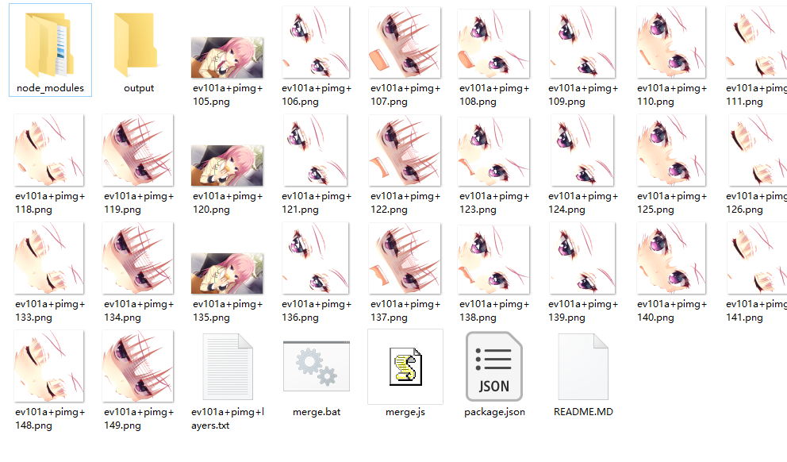
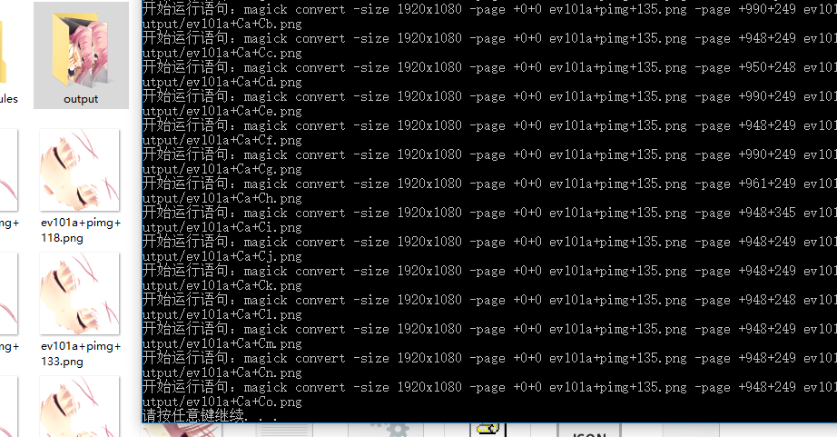

# krkrEvimageMerge

## 环境

> 请确保你的系统环境里安装了nodejs和 ImageMagick

开发所使用的环境

1. Windows10 1703 x64
2. nodejs 6.10.2
3. ImageMagick-7.0.7-28-Q16-x64-dll.exe

## 使用方法

> npm install应该无所谓 没有用依赖

1. 解包后的png和txt放入根目录

2. 运行merge.bat （请保证根目录下有output文件夹）

出现 "按任意键继续时" 可视为完成 文件保存在output下

## 关于我

[新浪微博](https://weibo.com/233742343/)

[bilibili](https://space.bilibili.com/259362/)

[Twitter](https://twitter.com/Sakuya_fm)